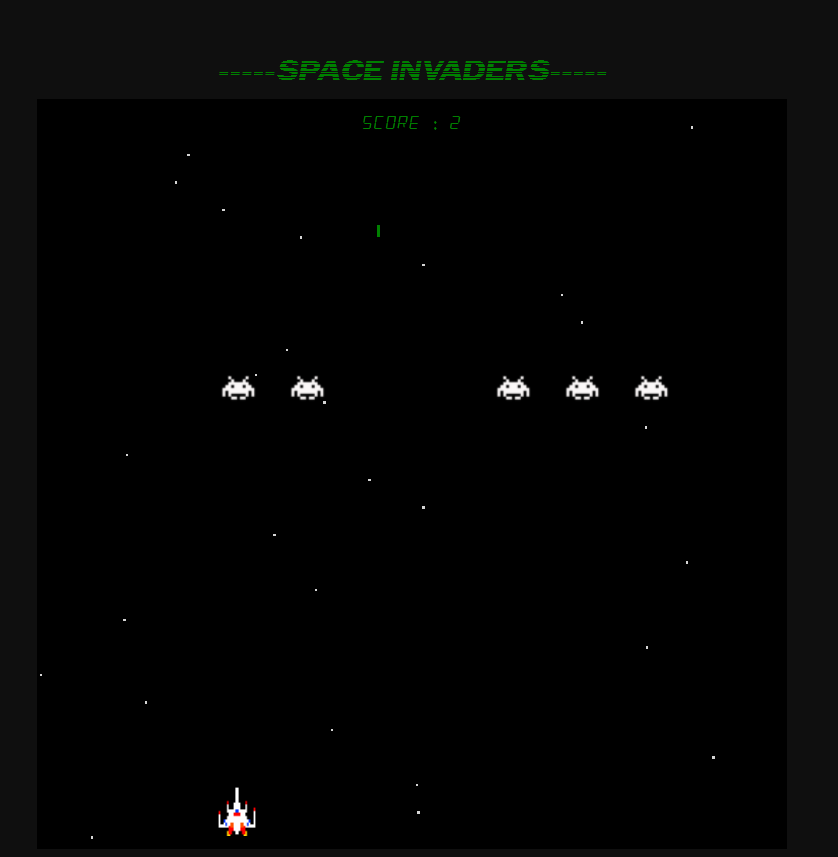
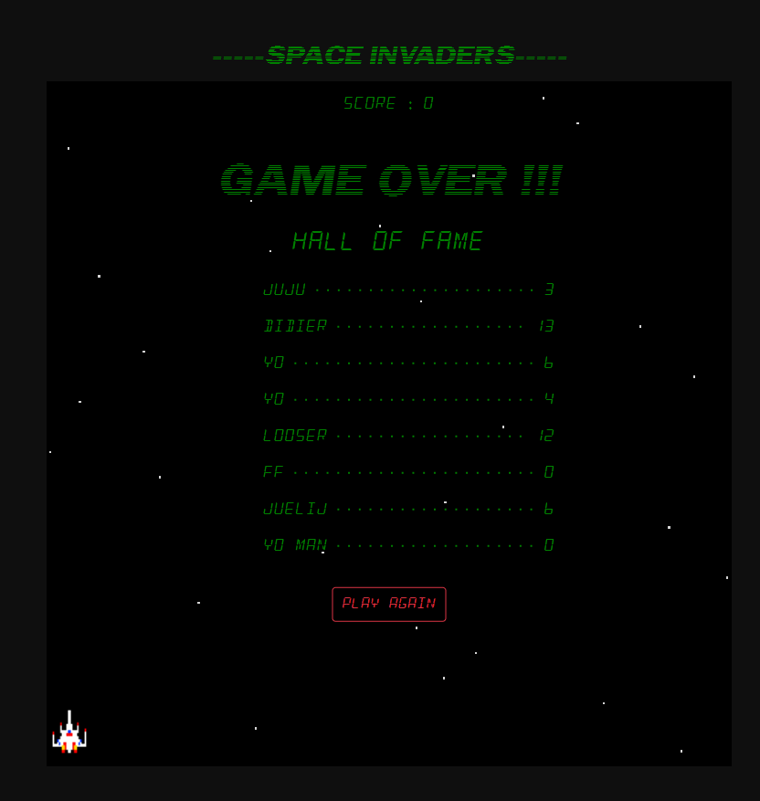

## Space Invaders en monorepo avec Lerna.
partie front : REACT / partie back : Node.js, Express, Mongodb 

## lerna run start --stream
pour démarrer le jeu en mode dev

***aller à droite*** : touche droite du pavé directionel 
*** aller à gauche*** : touche gauche du pavé directionel 
***tirer*** : touche espace

## aperçus

